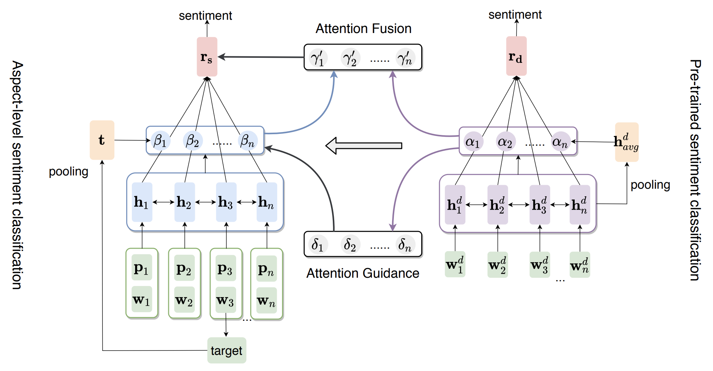

# ATN
ATN is the proposed model in 《[Attention Transfer Network for Aspect-level Sentiment Classification](https://aclanthology.org/2020.coling-main.70.pdf)》, which is accepted by COLING 2020.

## Overview



- In this paper, we transter attention knowledge from resource-rich document-level sentiment classification to resource-poor aspect-level sentiment classification.
- We design an Attention Transfer Framework (ATN) to enhance the attention process of resource-poor aspect-level sentiment classification.

## Dependencies

- python=3.5
- numpy=1.14.2
- tensorflow=1.9

## Quick Start

### Step1: pretrained (skip this step)
- train(for example, you can use the folowing command to pre-train DSC model)
```bash
python pre_train.py
```
- eval (at inference time, you can get attention scores)
```bash
python pre_train_eval.py
```
### step2: transfer
- Attention Guide

```bash
sh run_atn_guide.sh
```

- Attention Fusion
```bash
sh run_atn_fusion.sh
```
## Citation
```bash
@inproceedings{zhao-etal-2020-attention,
    title = "Attention Transfer Network for Aspect-level Sentiment Classification",
    author = "Zhao, Fei and Wu, Zhen and Dai, Xinyu",
    booktitle = "Proceedings of the 28th International Conference on Computational Linguistics",
    year = "2020",
    publisher = "International Committee on Computational Linguistics",
    doi = "10.18653/v1/2020.coling-main.70",
    pages = "811--821"
}
```
if you have any questions, please contact me zhaof@smail.nju.edu.cn.
